# Loopz js 2021

This is a tribute remake of the game Loopz. It was originally developed by Audiogenic Software Ltd in 1990 for the Atari ST and converted to Commodore Amiga 500 among other computers.

Having spent hundreds of hours playing Loopz on the Amiga for the past 30 years, I decided to recreate it as accurately as possible using HTML, CSS, SVG and JavaScript.

Enjoy!

<a href="https://lysebo.xyz/games/loopz" target="_blank">https://lysebo.xyz/games/loopz</a>

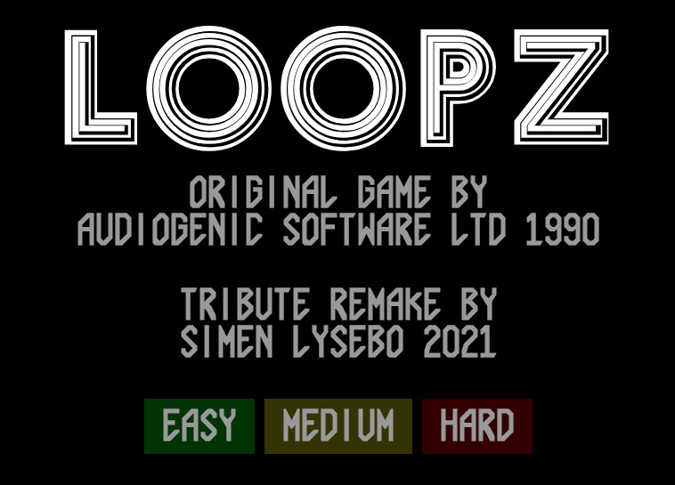&nbsp;
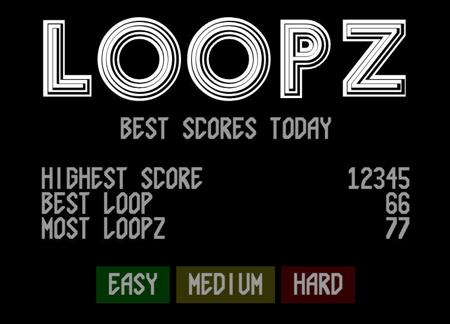
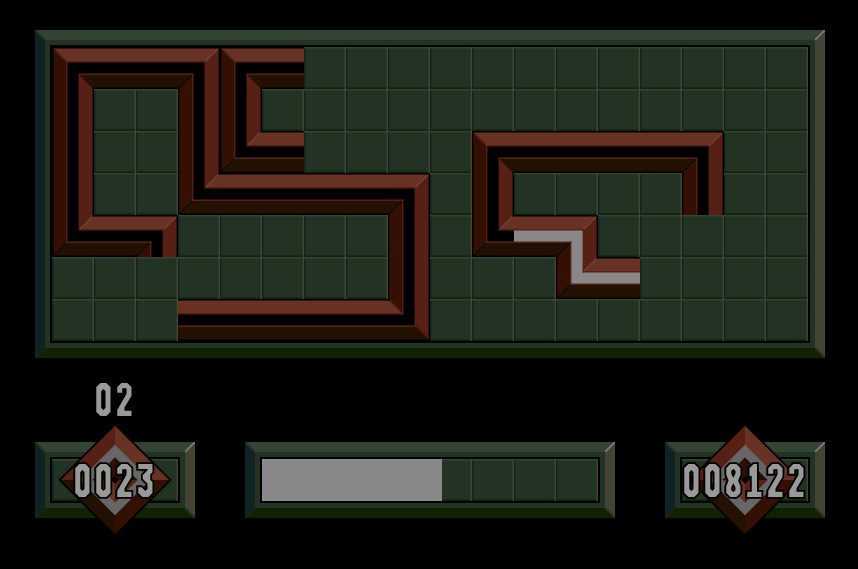

# Controls

The game can be played on both desktop and mobile, where desktop is **highly** recommended.

## Desktop

- Move piece with the mouse
- Left mouse button to drop the piece
- Right mouse button to rotate
- P to toggle pause

Pro tip: make the browser wide enough to give the mouse pointer some space outside of the board.

## Mobile

- Swipe anywhere to move the piece
- Tap board to drop the piece
- Tap below board to rotate
- Tap above board to toggle pause

Pro tip: just play on desktop :-D

# Memory lane

## General

Loopz is a meditative puzzle game along the lines of Tetris and Pipe Mania. The goal is to create loopz (closed circuits) with the different pipe pieces handed to you. Pieces can be rotated. When a loop is complete you get points based on the size of the loop. It will then disappear from the board, making space for more loopz. The different pieces vary in complexity, so it's advised to build multiple loopz at a time. Speaking of time.. it is running out, so you must place the piece on the board or end up losing a life.

## Amiga 500 version

The Amiga 500 version was converted from Atari ST. It received some criticism about the graphics being dark and uninspiring. Apparently the color palette was not adjusted for the Amiga in the conversion process.

I think the green marble-like theme fits perfectly into the Amiga style of that time. I also find the dark palette relaxing and perfect for a game that requires focus.

I only had a cracked version of the game on my Amiga. Some 20 years ago I found the game for sale online - and bought it - only to get the exact same version, `Cracked by Skid Row in 1991`.

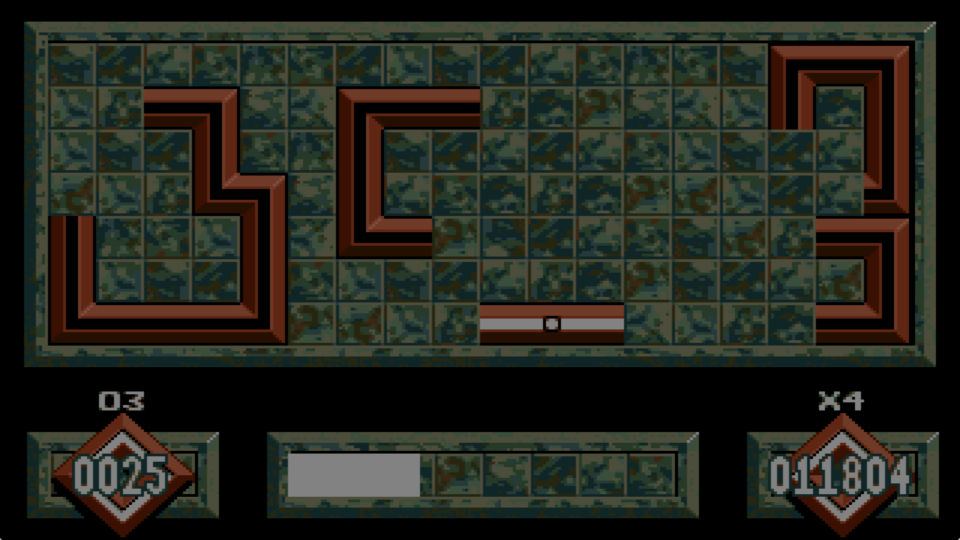

## Game modes

The original game has 3 game modes. I have implemented the game mode I always ended up playing, which is the endless supply of pieces for as long as you can manage to play.

# 2021 version

## Semi-responsive layout

There are different borders and paddings surrounding the tile grid. These have the same fixed pixel size regardless of the viewport size. The tiles are scaled responsively, making the game occupying as much of the space as possible (with a min/max size). This makes the game look nice on both small and large screens, without scaling the borders out of proportion.

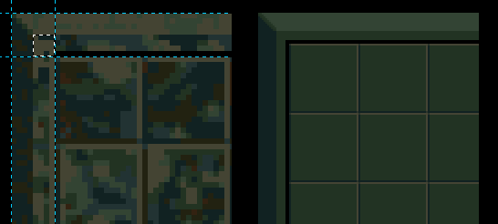

Tile size is always a whole integer, as opposed to a percentage of the available width. Size is calculated in JavaScript upon each resize. This eases the process of positioning, overlapping, collision etc. It also prevents any glitches/issues that may occur when each unique browser does its own percentage calculations and pixel roundings. Don't get me started on that topic!

Instead of recreating the marble pattern I have selected solid colors from the original palette. It looks cleaner while at the same time keeping the look and feel of the original.

## Pieces / piece primitives

There are 32 different pieces in the game. Every piece consists of one or more of the following piece primitives:

     _____     _____     _____     _____     _____     _____ 
    |  #  |   |     |   |  #  |   |     |   |     |   |  #  |
    |  #  |   |#####|   |  ###|   |  ###|   |###  |   |###  |
    |__#__|   |_____|   |_____|   |__#__|   |__#__|   |_____|
     

The piece container consists of a certain number of primitives, which are positioned relative to a defined origo.

All pieces (primitives) use the same SVG spritemap in CSS:

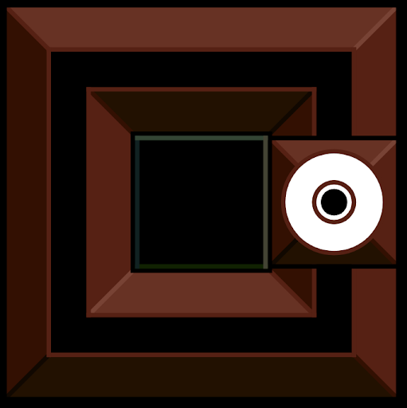

Included in the spritemap is also an empty tile and the special eraser piece. The background color of the empty tile and each primitive is transparent. When a loop is complete the background color of the tiles will lighten up, giving the impression that the core of the loop lights up. The current piece also has a light background. This makes it sufficient with only one set of graphics for the piece primitives. Visual effects are just simple CSS transitions/animations.

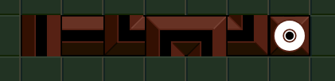

Each tile on the board gets a certain class attached to it, based on which piece primitive is placed. SVG graphics makes the game look sharp regardless of screen size. All modern browsers render SVGs fast, with the exception of Firefox which flickers a bit. I have considered rendering all SVGs to PNGs at startup/resize, but rejected it due to laziness. I will look into this on future projects.

## Character sets

The characters used for PAUSE and GAME OVER are reconstructed with SVG, to get smooth lines instead of pixelated graphics. Don't get me wrong! I love pixels! But with the smooth look & feel of the board and pieces, I wanted to extend that appearance to the fonts aswell.

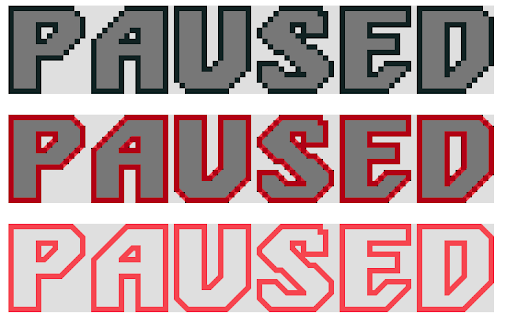  

The same goes for the numbers used in the different stats in-game. This is used as a spritemap:

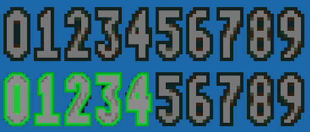  
  
  

Voila:  
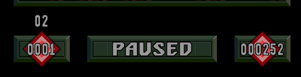  

Another SVG spritemap charset is constructed for the font in the intro:

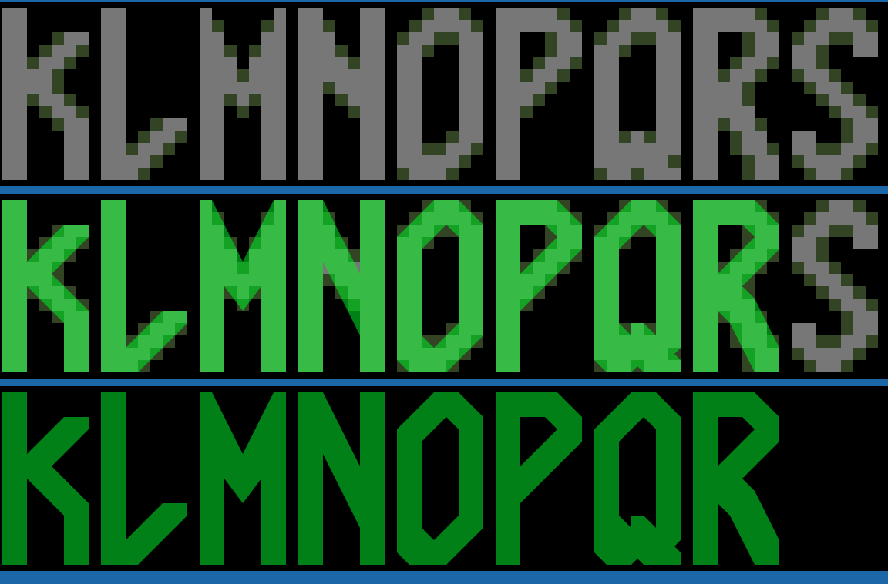  

It felt very old school to create charsets again! Hours and hours have been spent paying attention to the details of the original charsets, interpreting the pixels and translating them into SVG strokes and shapes. A time consuming yet satisfying process.

## Logo

This is the original logo as it appears in the game:

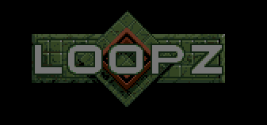  

Another logo is used on the cardboard box:

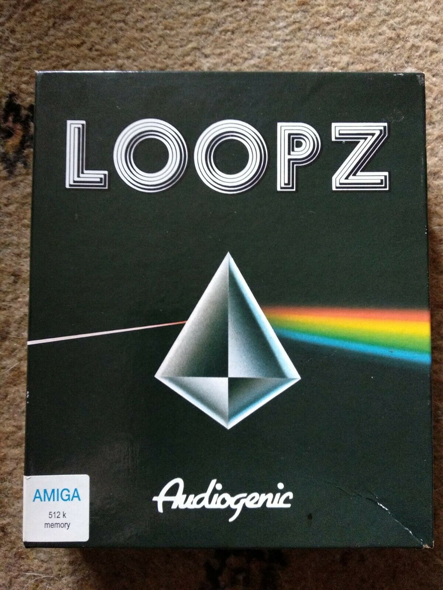  

That's a nice one! I had to recreate this in SVG aswell.

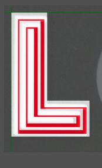

Work in progress, using the original as a backdrop and trying to figure out the correct offsets of the black and white layers. I noticed that the corners are somewhat rounded, but decided to ignore that!

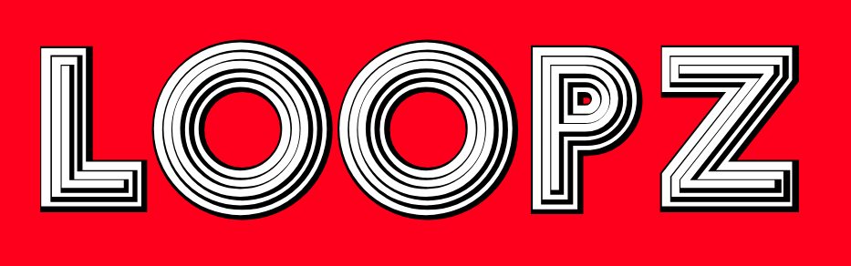

Gnarly!

## Piece randomiser

Pieces are selected randomly, but in cycles of increasing complexity. The first 25 pieces are always easy, and then the complexity cycle seems to be initiated. At times the game is horribly difficult, and the supply of advanced pieces seems so unfair. But that's also one of the reasons why I love the game! And why it was important to try and recreate this peculiar manner.

I have studied the frequence of pieces during long periods of gameplay. I made a small tool for registering, counting and calculating the statistics for each piece over time, including a chart to visualize it all. I didn't put much effort into the graphics here, to be honest.

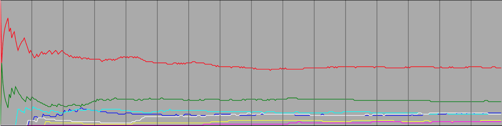

The advanced pieces (represented by white, pink, blue and yellow lines) come into existence after a while.

The conclusion is to use two types of bag randomisers. A new piece is always picked from the top of the bag. When the bag is empty, a new bag is generated. The first bag contains a selection of easy pieces. The following bags are more complex and somewhat organized after complexity. 

The complex bag is first filled with a selection of easy and intermediate pieces. It is then shuffled. Then the complex pieces are added. Finally the bottom 30% of the bag is shuffled. After some tuning it started to feel like the "true" Loopz piece randomizer algorithm. I would love to discuss this with the developer, though. Among other things.

## Eraser

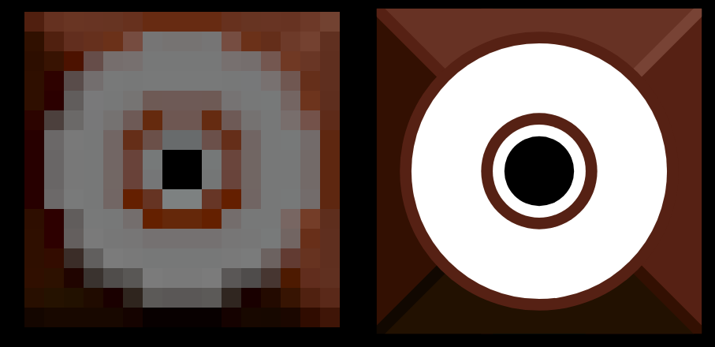

I don't know what the original eraser sprite is supposed to resemble. Possibly the eraser attached to the back of pencils. Or maybe a small loop symbol?

The algorithm that determines whether or not to give the player an eraser piece is as fuzzy as the sprite itself. Essentially though, the longer you've played without getting a loop the more likely it is to get an eraser. If you create loopz regularly you'll never get an eraser. If you just used an eraser, some time passes before you get a new one. The game rarely helps you out when the board is filled with impossible loop fragments. You're on your own to clean up your own mess. I have hated this game, and I love this game!

My take on the eraser algorithm is to always count down to the next "eraser time", while at the same time postpone it by different factors depending on if the player has completed a loop, just used an eraser or chosen not to use the previous eraser.

The old strategy of playing as slowly as possible, hoping for an eraser to appear, is still the only way out of trouble. Unless you are a pro gamer that builds multiple parallel loopz and always has a left over area for unsuspected pieces.

## Game music

The Amiga version has 3 in-game tunes. In 2012 I recorded a cover of one of them. I was thinking of maybe embedding it in the game, but for now you can play the music in a different tab. Check it out on SoundCloud:

https://soundcloud.com/simenlysebo/renee-renault-loopz-in-game

